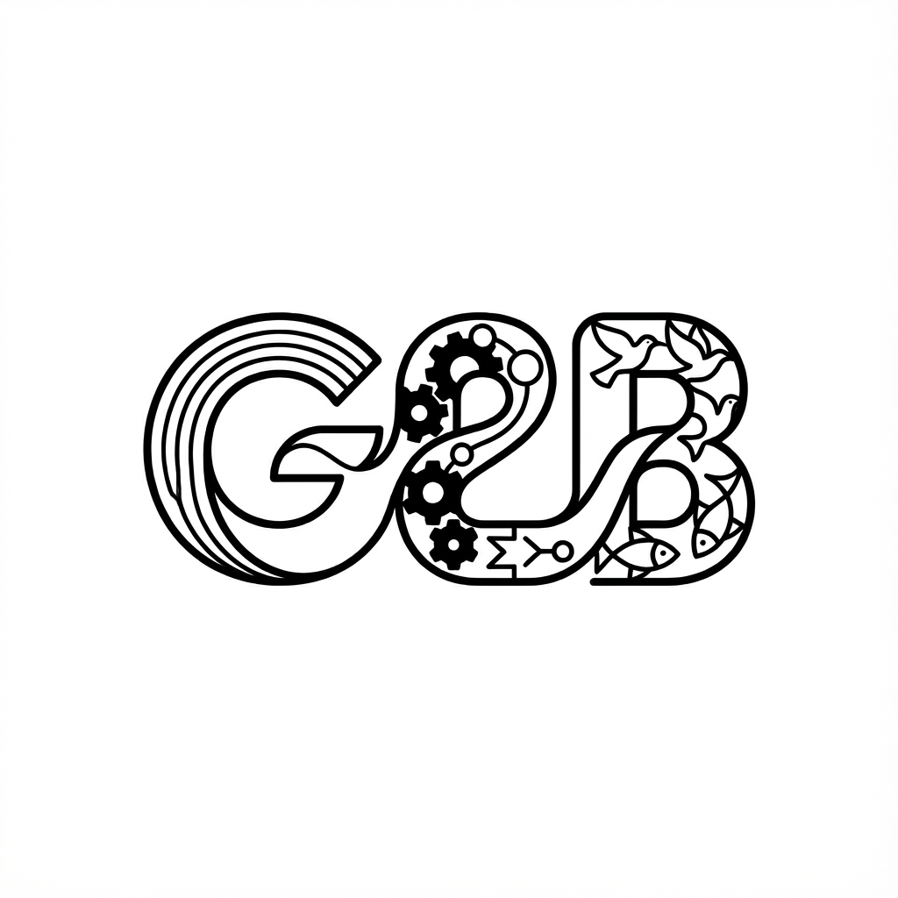

# [ME](https://github.com/zhuiyy/Me-with-a-big-big-band-of-crabs)
在read [me](https://github.com/zhuiyy/Me-with-a-big-big-band-of-crabs)之后, 你必定会点击:

### [这段非话要被点击了对吗?](https://zhuiyy.github.io/Me-with-a-big-big-band-of-crabs/)
  
为了能令人引人发笑, 最好把精华, 抽象的, 哪怕只有一句话放进READ[ME](..).md里, 例如：
  
  这篇READ[ME](https://github.com/zhuiyy/Me-with-a-big-big-band-of-crabs).md中至少包含三个‘READ[ME](https://github.com/zhuiyy/Me-with-a-big-big-band-of-crabs).md’

如你所见, GEB, 记忆笔, 加油吧, 进一步, 隔壁.

tips：GEB = Godel, Escher, Bach--An Eternal Golden Braid

当然, 这句话不是真的.

其实第六段中没有中文.

段中没有中文？文中没有中文？

为什么不创建新的md文件来评论笑话呢？[ME](https://github.com/zhuiyy/Me-with-a-big-big-band-of-crabs)是最深刻的词！

为什么不用音乐, 代码, 图片, 一切来评论！因为评论没法评论自己！这个笑话在哪来着......[k]

一切能触发美的联系, 对应, 同构, 都代表着宇宙可能的一次商! 你的findings能商得过宇宙扩张的速度吗?

你肯定能理解集异壁, 这将会是一段奇怪的体验, 你会感受到自己被包裹的同时包裹着包裹自己的东西, 你在集异壁里面, 集异壁也在你里面.

宇宙给了你无数的点, 你负责一点一点把他们连起来(这句话是个无与伦比的双关).

谁会连出什么样子? 全连接? 随机图? 全天88星座? 

甚至出现自环???

## 玩的开心！

某些行没有出现标点...（当然不是下面那行）

有些话其实是病句！（当然不是上面那行）

### 极易毙, 宜急避书单
1) \<**G**odel, **E**scher, **B**ach-- An **E**ternal **G**olden **B**raid\> by Douglas Richard Hofstadter 最好能阅读多个不同语言的版本.

2) \<House of Leaves\> by Jane Austen 最好能阅读英文彩图版. 理论上讲最好不要, 但是也可以试着提前[省流一下](https://www.bilibili.com/video/BV1w4VhzVE4B/?share_source=copy_web&vd_source=5674287728b697330ca58a945d07533a).

3) [\<Have the English any Sense of Humour?\>](./类笑话/Have%20the%20English%20any%20Sense%20of%20Humour/README.md) by Stephen Leacock

### Band大思考精选集:
1) [忘了.md](./纯GEB笑话/造物神/忘了.md)

### 重要新闻!

    三值逻辑研究已经有所推进!

###### 有人逼我写了这么一段话
*如果*你**觉得**[我](where.Zhuiy)疯了:

